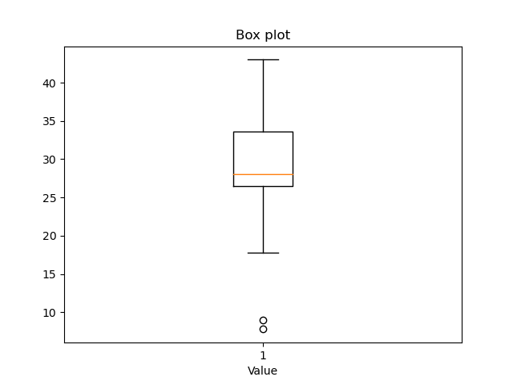
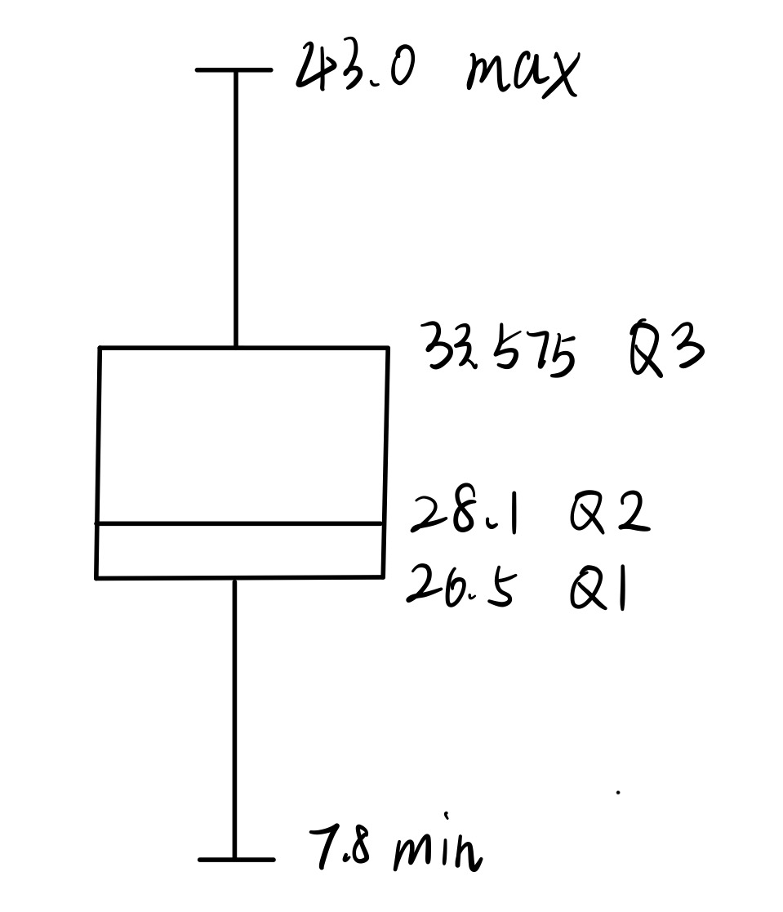

# 数据挖掘 Homework 2

赵晨阳 2020012363

## 数据属性联系

1. 教师的职称：职称这个概念具有全序性，彼此之间能够比较，也可以用于分类，因此是 Ordinal。
2. 手机号码：手机号码的值仅用于分类（比如地区）、定性，彼此间不存在顺序，且手机号码的差值和除法不具有物理意义，因此为 Nominal。
3. 体重：重量这一概念是连续的，具有数值意义。此外，重量存在明确的零值，也可以做具有实际意义的除法，故而为 Ratio。
4. 出生日期：出生日期的差值具有物理意义，然而没法对日期进行除法，日期也不存在绝对意义的零值，故而为 Interval。
5. 出生地：和手机号码类似（实际上号码也表征了地理位置），仅用于分类（比如地区）、定性，彼此间不存在顺序，且出生地的差值和除法不具有物理意义，属于 Nominal。
6. 年龄：年龄和出生日期不同，反而和体重类似。年龄这一概念是连续的，具有数值意义。此外，年龄存在明确的零值，也可以做具有实际意义的除法，故而为 Ratio。

## 计算统计信息

```python
import numpy as np
import matplotlib.pyplot as plt
from scipy import stats

# 读入浮点数组
arr = np.array([9.0, 26.5, 7.8, 17.8, 31.4, 26.5, 27.4, 26.5,
                34.6, 43.0, 28.8, 33.4, 27.4, 34.1, 32.9, 41.2])

# 对数组进行排序
arr_sorted = np.sort(arr)
print(arr_sorted)

# 计算均值、中位数和众数
mean = np.mean(arr_sorted)
median = np.median(arr_sorted)
mode = stats.mode(arr_sorted)[0][0]

# 计算五数概括
q1, q2, q3 = np.percentile(arr_sorted, [25, 50, 75])
min = np.min(arr_sorted)
max = np.max(arr_sorted)

# 绘制盒图
fig, ax = plt.subplots()
ax.boxplot(arr_sorted, vert=True)
ax.set_xlabel('Value')
ax.set_title('Box plot')
plt.show()

# 输出结果
print(f"Mean: {mean:.2f}")
print(f"Median: {median:.2f}")
print(f"Mode: {mode:.2f}")
print(f"Min: {min:.2f}")
print(f"Q1: {q1:.2f}")
print(f"Q2: {q2:.2f}")
print(f"Q3: {q3:.2f}")
print(f"Max: {max:.2f}")
```

程序的输出结果如下：

```python
Mean: 28.02
Median: 28.10
Mode: 26.50
Min: 7.80
Q1: 26.50
Q2: 28.10
Q3: 33.58
Max: 43.00
```

也即这组数据的均值为 28.02，中位数为 28.10，众数为 26.5。

五数概括如下：最小值 7.80，下四分位数 26.5，中位数 28.10，上四分位数 33.58，最大值 43.00。

通过 `matplotlib.pyplot` 得到的盒图如下：



不过，此处 `matplotlib.pyplot` 与课堂要求有所区别。按照我们课程所讲，将最大值和最小值进行修正后，得到的图像如下：



## 文本数据的表示

代码位于 `./tf-idf.py`，中途的若干多数据存储于对应的 `*.npy` 文件下。参考 `__main__` 部分的运行逻辑，大体实现思路如下：

### 构造文章与所有单词

通过 `dict_construct` 方法实现，分别读取所有的语料文件，将英文停用词去掉，同时将除了 `.` 的全部标调去除。对于 `.` 符号，需要注意到其·并不完全是起到句号作用，还有缩写意义。譬如，O.K. 这类词，不能简单讲 `.` 去掉。故而对 `.` 符号进行特判，倘若 `.` 前一位为数字或者小写字母，则将 `.` 替换。

至于停用词，利用 `nltk.stopwords` 实现了去除，避免大量无意义虚词影响统计结果。

如此将每篇文章的所有单词存入 `all_pages` 中，而全部单词则存入了 `all_words` 当中。`all_pages` 为一个 `list of list`，每个 `list` 中的单词在 100 左右；而统共单词数为 12833。

### 计算 `tf-idf` 矩阵

按照定义完成计算即可，需要注意到不能在上一步中对于每篇文章中的单词进行去重，因为 `tf` 需要考虑某个单词在某一篇文章中出现的总次数。

在实现过程中，我通过 `Pool()` 方法调度多线程加快了 `tf-idf` 的计算，在我的计算机上这一步计算需要花费 10min，故而我将结果利用 `numpy` 压缩保留，便于随后的反复计算。

### 计算 `co_exist_matrix`

`co_exist_matrix` 的定义并不麻烦，然而在存储上有两种思路。第一种是利用 `Dict`，以两个需要计算关系的单词 `word1` 和 `word2` 为 `key`；第二种是将每个单词映射为 `index`，然后存储一整个 `array`。从直观上，后者存储的矩阵是稀疏的，似乎会浪费存储空间。然而，Python 中 `Dict` 的实现是相对空间不够压缩的，而且 `word1` 和 `word2` 具有繁琐的排序问题。我们虽然可以通过对 `[word1, word2]` 通过 `sorted` 方法进行排序，但是仍旧繁琐。

考虑到之后计算欧氏距离与余弦相似度仍旧需要通过向量运算实现，而且 `numpy` 对于向量运算的优化是非常彻底的，故而我在上述 trade-off 中选择了第二种实现策略。

### 计算距离与相似度

这里完全利用 `numpy` 提供的向量运算接口即可高效完成。

### **文档相似度**

我选择 132 号文档进行分析，这份文档主要涵盖了美国职业体育联盟中棒球、篮球、橄榄球和冰球四个方面的最新动态，包括球队签约、任命教练、召回球员等。

**欧氏距离最接近的前 5 篇文档与其主要内容为：**

1. 88 号：棒球、篮球、足球、冰球以及大学体育方面的新闻，包括球队的签约、球员的被罚以及教练的任命等。

2. 187 号：据尼尔森的估计，周三的收视率再次由足球比赛统治，CBS 的节目排名第二，而 NBC 表现稍逊，ABC 的新节目则表现不佳。

3. 159 号：消费者报告指出，婴儿座椅在侧面碰撞时往往无法承受撞击力，经过实验室测试，其中十款产品均失败，座椅与底座分离，有的结果非常糟糕。

4. 86 号：该文是关于爵士钢琴家 Jason Lindner 的新专辑《Ab Aeterno》的介绍，强调了节奏在音乐中的重要性，并赞扬了该专辑中三位音乐家的默契互动和丰富的即兴演奏。

5. 192 号：一家政府监督组织对布拉戈耶维奇州长办公室提起了诉讼，试图获取联邦调查中所发出的传票副本，但遭到了州政府的拒绝。

**余弦相似度最高的前 5 篇文档与其主要内容为：**

1. 125 号：SCHNEYER--A. Edward 先生于 2007 年 1 月 13 日安详去世，享年 95 岁，他是一位忠实的丈夫、父亲和祖父，对家人十分热爱和珍视。

2. 182 号：FORMAN--Jo-Nan 女士的逝世消息和追悼信息，她于 2008 年 1 月 1 日在佛罗里达州博卡拉顿市平静地离世，享年65岁。

3. 133 号：金融顾问 Roy E. Posner 因心脏病突发去世，他曾长期为纽约巨人队工作。

4. 99 号：约翰·爱德华兹前参议员在曼哈顿呼吁立即从伊拉克撤军，并表示国会议员有权制止总统加强战争。

5. 29 号：一名前加州美国红十字会橙县分会的会计高管被指控盗用超过 10 万美元，引发了对美国红十字会及其分会财务管理的担忧。

**分析**

欧氏距离找到的相似文献有 2 篇相似，而余弦相似度计算出的文献仅有 1 篇相关联，而且其文章中含有大量的讣告。整体而言，这一结果不尽如人意，然而考虑到 132 号文档中介绍了若干体育队伍的人员变动信息，其中含有大量的人名地名，得到的相似结果也大量含有人名与地名，具有一定的合理性。此外，我虽然采用了停用词降低无意义虚词对于 `tf-idf` 的影响，然而特征词的采用中仍旧有一定量的虚词。因此，前期处理语料时应当考虑对姓名等专有名词进⾏适当忽略。

### 词语相似度

我选择 school 为分析的目标词语，得到结果如下：

**欧氏距离最接近的前 5 个实词：**

1. great
2. history
3. notes
4. study
5. jersey

**余弦相似度最高的前 5 个实词：**

1. would
2. university
3. could
4. David
5. history

效果比起文档相似更好。在欧氏距离中，较为相关的词有 history，notes 和 study；而在余弦相似度中，比较相近的词有 university 和 history。

### 结论与反思

综合来看，`tf-idf` 和 `co_exist` 的方法还是较为粗糙，这种传统的 `sparse information retrival` 方法的价值较为受限。当然，`dense information retrival` 可能效果更佳，然而操作更为复杂。

本次实验我大量采用了 `Pool` 方法和 `numpy` 的内置函数加速并行计算，极大方便了实验的进行。

最后，我对语料处理有了粗浅的了解，还使用一些⽂本处理的库进行了基本的动手实践。即便是 sparse ⽂本挖掘，其本身操作也非常灵活，值得深入挖掘，并且对我个人研究 `dense IR` 起到了很好的引导作用。
