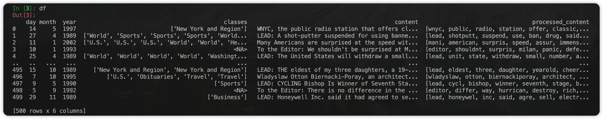
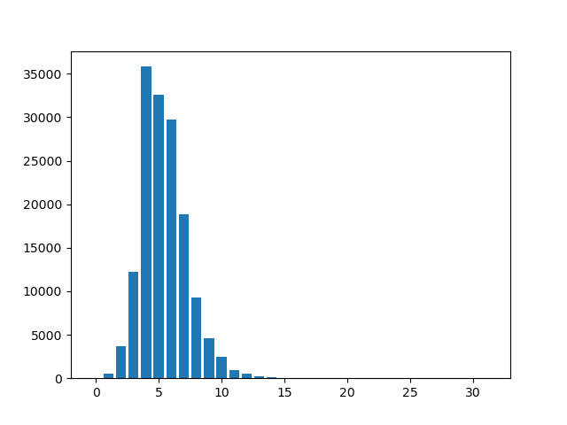
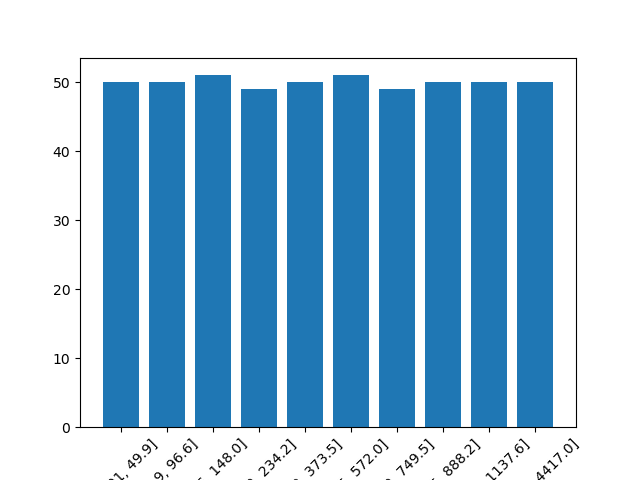
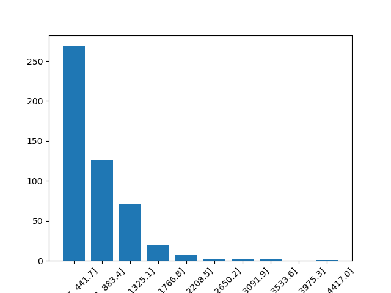
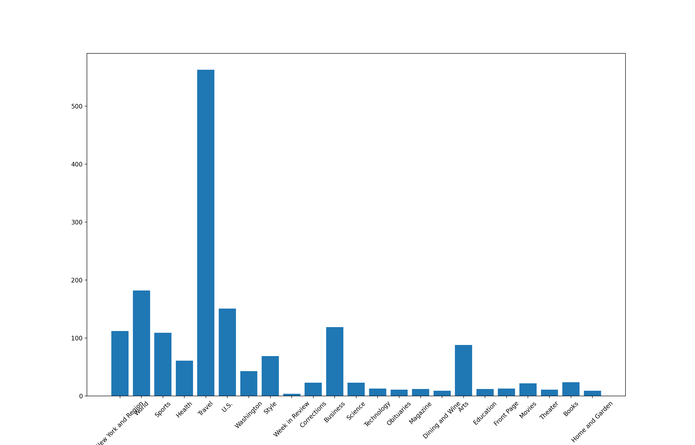
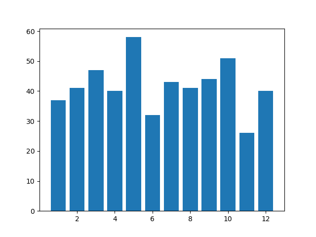

# 数据挖掘 Homework 3

赵晨阳 2020012363

## 数据预处理与可视化

### 新闻数据读⼊与建⽴数据框对象

创建 `DataFrame`，利⽤ `elemmentTree` 等进⾏处理。⽣成的数据框对象中的属性包括⽇期、类别和时间，定义其展示顺序为 `["day", "month", "year", "classes", "content", "processed_content"]`，其中 `processed_content` 为经过预处理后的 `content`。完成了去除标点符号、停用词、数字、空白字符，将大写字母都转化为小写，以及词干化处理。

得到的 `DataFrame` 对象如下：



### 预处理

预处理过程主要是各种词句的摘取、简化与筛选。综合使⽤了 `nltk` 库中的 `stopwords , SnowballStemmer` 等词句处理工具，尽管 `nltk` 库相对 `HuggingFace` 等等 toolkits 相对简单，但是也取得了非常良好的效果。其他处理工具还有 `re` 库中的替换函数 `sub`，字符串自带的 `lower` 等通⽤函数。经过去除标点符号、停⽤词、数字、空⽩字符、⼤写转⼩写、词⼲化等预处理后，得到 `all_words` 长度为151811，而 `all_classes` 长度为 1683。 

### BOW 表示

将每⼀篇新闻的全⽂表示成 `BagOfWords` 向量，根据相应计数⽅式计算 `BagOfWords` 向量：

```python
def create_bag_of_words(
    processed_content: List[str], all_unique_words: List[str]
) -> np.ndarray:
    bag_of_words = np.zeros(len(all_unique_words))
    for word in processed_content:
        if word in all_unique_words:
            bag_of_words[all_unique_words.index(word)] += 1
    return bag_of_words
```

得到的 `bag_of_words_all` 情况如下：

```python
In [16]: bag_of_words_all.shape
Out[16]: (495, 16552)

In [17]: bag_of_words_all.sum()
Out[17]: 151811.0
```

### 词云图

利用 Counter 类可以便捷地统计词频信息：

```python
In [18]:     top_words = Counter(all_words).most_common(100)
    ...:     print(top_words)
[('said', 1932), ('mr', 1462), ('new', 850), ('year', 828), ('would', 667), ('one', 646), ('state', 595), ('compani', 541), ('like', 473), ('also', 453), ('time', 452), ('two', 419), ('peopl', 415), ('last', 414), ('work', 402), ('say', 389), ('york', 361), ('american', 359), ('nation', 340), ('percent', 331), ('first', 325), ('unit', 306), ('make', 305), ('school', 303), ('go', 295), ('mani', 293), ('million', 293), ('presid', 289), ('even', 288), ('includ', 283), ('get', 279), ('use', 277), ('day', 275), ('citi', 274), ('could', 273), ('report', 260), ('today', 259), ('call', 253), ('street', 251), ('offici', 247), ('may', 246), ('offic', 234), ('three', 233), ('share', 230), ('way', 228), ('month', 225), ('govern', 221), ('hous', 218), ('ms', 218), ('open', 214), ('much', 213), ('pm', 209), ('week', 207), ('group', 206), ('sale', 206), ('univers', 206), ('center', 205), ('made', 205), ('world', 199), ('countri', 199), ('take', 196), ('still', 196), ('public', 195), ('come', 195), ('law', 195), ('lead', 194), ('chang', 190), ('program', 189), ('want', 187), ('sinc', 187), ('tax', 184), ('plan', 184), ('art', 184), ('play', 181), ('part', 180), ('famili', 180), ('back', 180), ('live', 179), ('run', 178), ('look', 178), ('seem', 177), ('dr', 173), ('book', 170), ('anoth', 170), ('well', 168), ('need', 168), ('life', 167), ('recent', 165), ('sever', 164), ('end', 164), ('home', 163), ('think', 163), ('place', 162), ('yesterday', 161), ('right', 161), ('director', 161), ('help', 160), ('market', 159), ('long', 159), ('case', 158)]
```

随后绘制出的词云图如下：


### 单词长度分布

统计得到最长的单词不超过 `31`，进一步得到的单词长度分布如下：

```python
In [3]: word_lengths
Out[3]: 
array([0.0000e+00, 5.3700e+02, 3.6280e+03, 1.2240e+04, 3.5821e+04,
       3.2608e+04, 2.9747e+04, 1.8821e+04, 9.2570e+03, 4.6430e+03,
       2.4900e+03, 9.3900e+02, 5.3200e+02, 2.5200e+02, 1.3400e+02,
       6.2000e+01, 4.1000e+01, 1.2000e+01, 2.7000e+01, 4.0000e+00,
       5.0000e+00, 2.0000e+00, 0.0000e+00, 1.0000e+00, 3.0000e+00,
       1.0000e+00, 2.0000e+00, 1.0000e+00, 0.0000e+00, 1.0000e+00,
       0.0000e+00, 0.0000e+00])
```

得到的柱状图如下：



### 等深分箱与等宽分箱

等深分箱如下：



等宽分箱如下：



### 按类别新闻数量分布柱状图

根据结果绘制出柱状图，分布情况如柱状图所示：



### **按⽉新闻数量分布柱状图**

根据结果绘制出柱状图，分布情况如柱状图所示：


