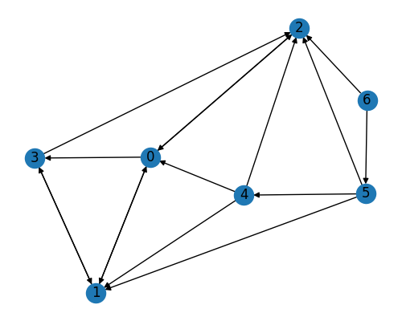

# 1

在无向图中，每条边对总度数的贡献为 2，因为它连接了两个节点。在有向图中，每条边对起始节点的出度贡献为 1，对终止节点的入度贡献为 1。因此，在无向图中，每个节点的平均度数等于总边数乘以 2 除以节点数，也即 $\dfrac{2 m}{n}$；在有向图中，每个节点的平均出度和入度都等于总边数除以节点数，也即 $=\frac{m}{n}$。

# 2

参考讲义，clustering coefficient 的计算公式为：
$$
c c\left(v_i\right)=\frac{\left|\left\{e_{i k}, e_{i j}, e_{k j} \in E\right\}\right|}{d\left(v_i\right) \times\left(d\left(v_i\right)-1\right) / 2}\\=\frac{\# \text { triangles formed by } v_i \& \text { its neighbors }}{\# \text { possible triangles by } v_i \& \text { its neighbors }}
$$
带入此题，有：
$$
c c(v)=\frac{2 \times 8}{8 \times(8-1)} \approx 0.286
$$

# 3

D, Usually much smaller than $|V|$

# 4

## 代码原理

PageRank 算法由 Google 的创始人 Larry Page 和 Sergey Brin 在斯坦福大学完成，用于确定网页的重要性或相关性，是 Google 搜索引擎的基础。PageRank 算法假设更重要的网页可能会得到更多的链接，通过链接到网页的数量和质量来确定网页的重要性，其计算公式如下：
$$
PR(A) = (1-d) + d \left( \frac{PR(T1)}{C(T1)} + \ldots + \frac{PR(Tn)}{C(Tn)} \right)
$$

其中：

- $PR(A)$ 是网页 A 的 PageRank。
- $PR(T1)$ 到 $PR(Tn)$ 是链接到网页 A 的各个网页的 PageRank。
- $C(T1)$ 到 $C(Tn)$ 是链接到网页 A 的各个网页的链接数量。
- $d$ 是阻尼因子，我的实现中设置为 0.85。

这个公式可以看作是一个迭代过程，开始时，所有网页的 PageRank 都被设置为 1。然后，该算法会不断更新每个网页的 PageRank，直到算法收敛。

可以使用矩阵形式来表示具体算法，设 $\boldsymbol{X}$ 为所有网页的 PageRank 值，$\boldsymbol{A}$ 为网页的链接矩阵，$\boldsymbol{D}$ 为每个网页的链接数量的对角矩阵，我们可以得到以下的迭代公式：

$$
\boldsymbol{X} = \beta \boldsymbol{D}^{-1} \boldsymbol{A} \boldsymbol{X} + (1-\beta) \frac{1}{|V|}
$$

其中，$\beta$ 是阻尼因子，$|V|$ 是网页的总数。上式表示每次迭代中，每个网页的 PageRank 值是其所有入链的网页的 PageRank 值的加权平均，权重为该网页的链接数量的倒数。同时，为了防止某些网页没有出链，引入了一个随机游走参数 $(1-\beta) \frac{1}{|V|}$。

在实现过程中，我们需要注意的是，如果某个网页没有出链，即 $\boldsymbol{D}$ 的对角元素为 0，为了防止除以 0 的错误运算发生，我们将该项置为 1。

## 实现思路

参考 `pagerank.py`，通过 `PageRank` 类实现了算法，并且与 `networkx` 进行直接对比。以下为 `PageRank` 类的具体实现。

1. **初始化**：`__init__(self, beta=0.85)` 构造函数，初始化阻尼因子 beta，节点到整数的映射字典 node_to_num，以及节点数量  N。

2. **节点映射**：`create_node_mapping(self, edges)` 函数用于将图中的节点映射到整数，方便后续操作。遍历边列表，找出所有节点，并为每个节点分配一个唯一整数标识。同时更新节点数量 N。

3. **构造邻接矩阵**：`create_adjacency_matrix(self, edges)` 函数根据边的信息构建邻接矩阵，并进行列归一化。首先创建一个 N×N 的零矩阵，然后根据边的信息，将邻接矩阵中对应的元素设为 1。最后，进行列归一化，使得每一列的元素之和为 1。

4. **计算 PageRank**：`calculate_pagerank(self, S)` 函数根据 PageRank 的迭代公式进行计算，直到收敛。它首先根据公式创建转移矩阵 A，然后初始化 PageRank 向量 P_n 和 P_n1，然后进行迭代，每次迭代中，根据公式更新 P_n，直到 P_n 的值收敛。

5. **公共接口**：`get_pagerank(self, edges)` 函数是主要的公共接口，首先调用 `create_node_mapping` 函数和 `create_adjacency_matrix` 函数构造节点映射和邻接矩阵，然后调用 `calculate_pagerank` 函数计算 PageRank，最后将结果转换为节点和其对应的 PageRank 值的映射，返回映射。

```python
import networkx as nx
import matplotlib.pyplot as plt
import numpy as np


class PageRank:
    def __init__(self, beta=0.85):
        self.beta = beta
        self.node_to_num = {}
        self.N = 0

    def create_node_mapping(self, edges):
        nodes = []
        for edge in edges:
            if edge[0] not in nodes:
                nodes.append(edge[0])
            if edge[1] not in nodes:
                nodes.append(edge[1])

        self.N = len(nodes)

        # 将节点映射到整数值
        i = 0
        for node in nodes:
            self.node_to_num[node] = i
            i += 1
        for edge in edges:
            edge[0] = self.node_to_num[edge[0]]
            edge[1] = self.node_to_num[edge[1]]

    def create_adjacency_matrix(self, edges):
        # 初始化 S 矩阵
        S = np.zeros([self.N, self.N])
        for edge in edges:
            S[edge[1], edge[0]] = 1

        # 列归一化
        for j in range(self.N):
            sum_of_col = sum(S[:, j])
            for i in range(self.N):
                S[i, j] /= sum_of_col

        return S

    def calculate_pagerank(self, S):
        A = self.beta * S + (1 - self.beta) / self.N * np.ones([self.N, self.N])

        P_n = np.ones(self.N) / self.N
        P_n1 = np.zeros(self.N)

        e = 100000

        while e > 1e-3:  # 迭代
            P_n1 = np.dot(A, P_n)
            e = P_n1 - P_n
            e = max(map(abs, e))
            P_n = P_n1

        return P_n

    def get_pagerank(self, edges):
        self.create_node_mapping(edges)
        S = self.create_adjacency_matrix(edges)
        P_n = self.calculate_pagerank(S)

        result = {}
        for node, num in self.node_to_num.items():
            result[node] = P_n[num]

        return result


if __name__ == "__main__":
    edges = [
        ["1", "2"],
        ["1", "3"],
        ["1", "4"],
        ["2", "1"],
        ["2", "4"],
        ["3", "1"],
        ["4", "2"],
        ["4", "3"],
        ["5", "2"],
        ["5", "3"],
        ["5", "1"],
        ["6", "2"],
        ["6", "3"],
        ["6", "5"],
        ["7", "3"],
        ["7", "6"],
    ]

    pagerank = PageRank()
    P_n = pagerank.get_pagerank(edges)
    print("PageRank (Custom Implementation):", P_n)

    pagerank_list = nx.pagerank(G, alpha=0.85)
    print("PageRank (NetworkX):", pagerank_list)

    G = nx.DiGraph()
    for edge in edges:
        G.add_edge(edge[0], edge[1])
    plt.figure(figsize=(5, 4))
    nx.draw(G, with_labels=True)
    plt.show()
```

## 实现结果

```python
PageRank (Custom Implementation): {'1': 0.30128341745857534, '2': 0.20653357735051944, '3': 0.21564072020766228, '4': 0.1944976421260999, '5': 0.030080357142857145, '6': 0.030535714285714288, '7': 0.02142857142857143}
PageRank (NetworkX): {'1': 0.30110462617247735, '2': 0.20659864914683923, '3': 0.21570579200398207, '4': 0.19454628981955846, '5': 0.030080357142857145, '6': 0.03053571428571429, '7': 0.021428571428571432}
```

可以看到，对于下图，我实现的 `PageRank` 类和 `NetworkX` 实现的效果基本完全相同：


