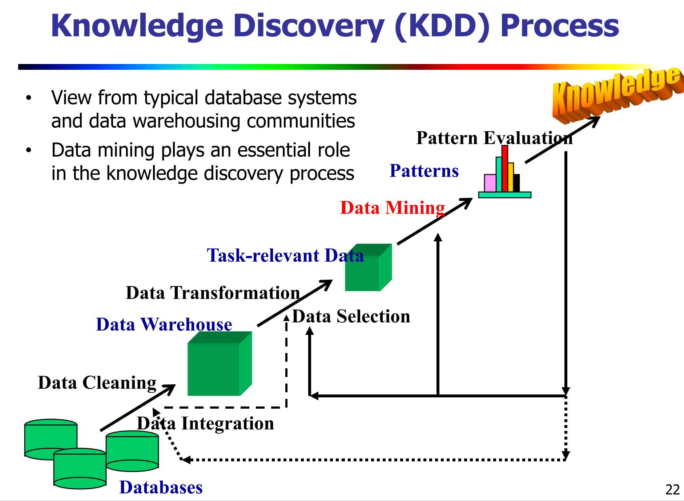

# Introduction

## Motivation: what is and why data mining

---

### Datamining的定义
- Data Mining(DM) is also called Knowledge Discovery in Databases(KDD)
- 我们的目标是找到valid, novel, usefual and ultimately understandable 的 patterns
- 我们需要在数据中 discover structure and make predictions

### Big Data的五个特征
- 规模性（Volume）
- 多样性 （Variety）
- 快速性 (Velocity)
- 真实性 （Veracity）
- 价值性 （value）

### Big Data and Deep Learning

**Representation Learning** 的定义：
Representing objects as **real valued vectors** in a **low dimensional semantic space** based on their distribution in big data

### Data driven 深度学习优缺点

- **优点**
    - perceptual computing
    - remember and learning
    - large scale computing
    - associating computing
- **缺点**
  - low level features
  - End-to-End system
  - black box: hard to explain
  - difficult to integrate prior knowledge

## Data Mining Framework: the steps of process

### KDD process

大概人话解释一下就是：得到数据、数据清洗和预处理、（选择适合的工具进行）数据挖掘、挖掘效果评价

### 数据挖掘的起源

原始的一些方法在大数据挖掘中不能使用的原因：
- 超大规模
- 高纬
- 异构分布

## Data Mining Tasks

主要可以分为**Predictive Tasks**和**Descriptive Tasks**两大类
- **Predictive tasks**:
  - Use some variables to predict unknown or future values of other variable
  - Examples: Classification, Regression, Diviation/Outlier Detection
- **Descriptive tasks**:
    - Find human-interpretable patterns that describe the data
    - Examples:  Association Rule Discovery,  Clustering,  Sequential Pattern Discovery

具体案例的我觉得根本没办法出题。
