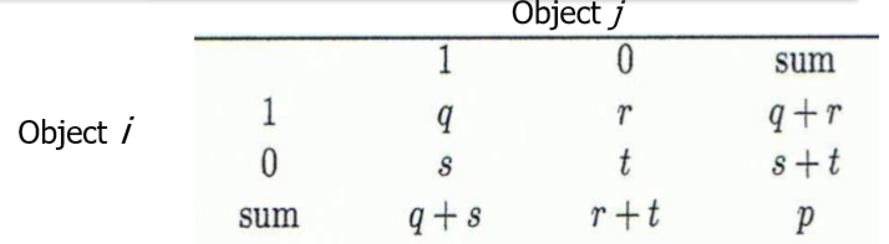

# Get to Know Your Data

- Data sets are made up of data objects.
- A collection of attributes describes a data object.
- An attribute is a property or characteristic of an object.

- A measurement scale is a rule that associates a value with an attribute of an object.

最后一句话意味测量标度是将数据点的某个属性与一个值关联起来的方法

## **特征的类别**

- Quantitative vs. Qualitative 可量化的与不可量化的，准确的来说是可测量的和不可测量的。注意，并不是标量都是可测量的。**譬如 IP 地址实际上不是可测量的，而是人为约定的。**
- Discrete vs. Continuous 离散与连续：离散特征具有有限个可能或者可数无穷个可能，连续特征在任意两个值之间还有无数个值，譬如温度和海拔。

- 不可量化特征一定是离散的，可量化特征可能是离散的，也可能是连续的

---

- **Nominal or Ordinal 无序和有序**，后者存在具有实际意义的顺序意义。所有的不可量化特征要么是有序的，要么是无序的。binary attributes 二分属性是无序的。A binary attribute is **a nominal attribute with only two categories or states: 0 or 1**, where 0 typically means that the attribute is absent, and 1 means that it is present. 课件上的例子：Nominal attributes (binary attributes) Marriage status, eye color, **Customer ID**
- Interval or Ratio 距离和比率。前者不存在真实的零点，**除法没有实际意义**，譬如摄氏温度。后者存在实际的零点，除法具有实际意义，譬如体重。除法意味着“增长了 5%”这样的语句是有意义的。对于二者最好的区别是考虑除法的意义。
	课件上的例子：(Interval attributes) calendar dates, **temperatures in Celsius or Fahrenheit**, GRE score; (Ratio attributes) **temperature in Kelvin**, length, time, counts

备注，GRE 分数我个人理解应该是 Ratio 的，而 Customer ID 比如 202002223 这种是有序的，但是 1asfaf4213 这种就是无序的。

**老师的结论是不考这种有争议的。**

----

运算支持 Distinctness $=,\ne$	 Order $<,>$	 Addition $+,-$	 Multiplication $\times,/$

Nominal attribute: distinctness	Ordinal attribute: distinctness & order	Interval attribute: distinctness, order & addition	Ratio attribute: all 4 properties

## 数据表征

Record Data: 由一组记录组成的数据，每个记录由固定的属性 / 功能功能组成，可以组成 Data Matrix。

Document Data BOW 方法：首先得到所有文档中的全部单词，而后统计每篇文档中出现某个单词的次数。**直观上就是每个词在每篇文章中出现的次数。**

**TF-IDF**：TF （词频）为某个词在某篇文章中出现的比例，也即单词 w 在文章中出现的次数 / 文章总共的单词数。IDF （逆文本频率）为 log(总共文章数目 / 包含 w 的文章数目)。一片文章的特征就是每个词的 tf \* idf 组成的向量。

 Transaction Data：交易数据，一类特殊的 Record Data

## 数据描述

对于单峰数据（Unimodal Frequency）而言，mean - mode = 3 \* (mean - median)，mode 是众数。

学生的得分一般而言平均数低于中位数，而个人收入一般而言平均数高于中位数。

**五数概括如何确定 Outlier？**

举个例子：`{13，15，16，16，19，20，20，21，22，22，25，25，25，25，30，33，33，35，35，35，35，36，40，45，46，52，70}`

n = 27 个数，那么哪些数据没有参考意义呢？

先确定位置：（n + 1）* （1 / 4） = 7，所以 Q1 = 20

先确定位置：（n + 1）* （2 / 4） = 14，所以 Q2 = 25

先确定位置：（n + 1）* （3 / 4） = 21，所以 Q3 = 35

所以 IQR = Q3 - Q1 = 15

除了中间 50% 的数据可以用，那么还有哪些数据可以用呢？利用 IQR 来求数据中的上边缘：`Q3 + 1.5 * IQR = 57.5`下边缘：`Q1 - 1.5 * IQR = -2.5 < 0，取 0`，所以数据中有效部分为 `[0, 57.5]`。对比数据集中的数据发现 70 是孤立点，即去除。所以，max 是 52，而非 70。

**最后，min = 13，max = 52。**

## 相似度与距离

相似度 [0, 1]；而不相似的程度即为距离。

距离通常是对称的，且自身相对自身的距离为 0，故而距离矩阵可以只取下三角部分。

欧式距离、曼哈顿距离、民可夫斯基距离，切比雪夫距离：$\sqrt{\sum_{i=1}^n|p_{ki}-q_{ki}|^2},\sum_{i=1}^n|p_{ki}-q_{ki}|,\sqrt[r]{\sum_{i=1}^n|p_{ki}-q_{ki}|^r},\max\limits_{i=1}^{n}|p_i-q_i|$

切比雪夫距离是距离的上确界（距离的最小上界）

距离的性质：三角不等式、对称性、正则性（距离都是正值，自身和自身距离为 0）

距离是表征不相似度的，而相关性也具有性质：自身和自身完全相似、对称性。

**二元属性值的相似度**

q：表示对象 i 与对象 j 都取 1 的属性数，其余类似，p：表示刻画对象的属性总数

二元属性分为对称性和非对称两种：

- 对称性二元属性：0 和 1 状态同等重要

- 非对称二元属性：两个状态不是同等重要的，两个都取 1 比两个都取 0 的情况更有意义，故而忽略掉上图 t 的部分

如此可以计算对称性二元属性的相异性：`(r + s) / (q + r + s + t)`。而非对称的二元属性相异性为 `(r + s) / (q + r + s)`，而相似性则为 `(q) / (q + r + s)`，又被称为 Jaccard 系数。

接着还有些花里胡哨的距离方法，在 PPT 61 页和 62 页，这里去看教材的 50 页即可。
