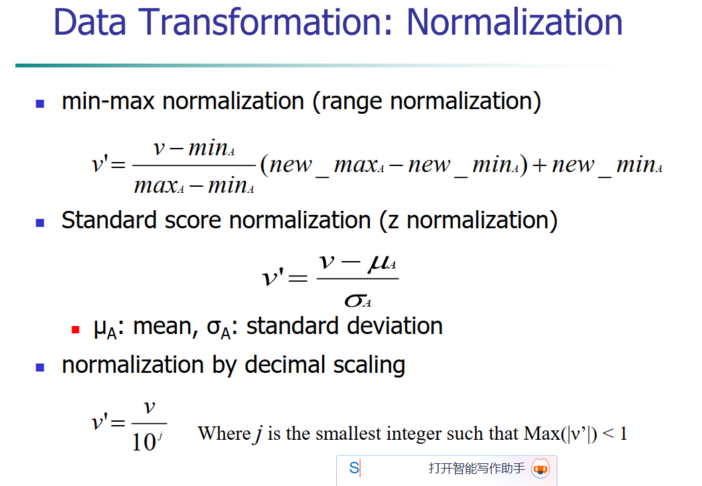

# Chapter3 Data Processing

## 1 Why Process Data

现实世界中的 data 会包含如下问题：Incomplete，Noisy， Inconsistent，Intentional

Noise 是对原有数据的 modify 

outlier 有时会阻碍数据分析，有时正是分析的目标

#### 1.1 Data Quality Measurement

- Accuracy
- Completeness
- Consistency
- Timeliness
- Believability
- Value added 有附加价值的
- Interpretability
- Accessibility

以下将分为 Data Cleaning, Data Integration, Data Reduction, Data Transformation

## 2 Data Cleaning

目的：填补空缺值，识别离群点并且 smooth 数据，修正不一致的数据，修复数据合并带来的数据冗余

### 2.1 Handle Missing Data

- 忽略有 missing data 的 tuple
- 手动补上缺失值
- 自动补全：使用全部数据均值；同一类数据的均值；使用回归或者贝叶斯推断预测的最有可能的值

#### 2.2 Handle Noisy Data

- 分箱 binning ：包括用均值光滑，中位数光滑，边界光滑
  - binning 又分为等深和等宽分箱
    - 等宽分箱可能会被离群点主导，不能处理好 skewed data，也就是偏斜数据
- 用聚类找到离群点
- 将数据拟合到回归得到的直线上
- 人工找

PPT 上有几个例子，在第 19-21 页

## 3 Data Integration

将不同源的数据合并起来

- schema integration 用我们知道的知识做合并，例如 A.cust_id = B.cust 
- Entity Identification 搞一个自动化流程帮我们检测不同数据源中的实体是否对应
- Detecting and Resolving data value conflict

### 3.1 Handle Redundancy

- 实体识别
- derivable data 从一个属性值中 derive 出来的，这种 data 是没有必要保留的

卡方检测：算一个观测量和一个期望，进行比较，最后得到的卡方值越大，说明这两个数据的越有可能相关。PPT 27 页有一个例子，会算就好

Correlation Analysis：这和概统的协方差是一个东西，刻画两个数据之间的正负相关性的。

Record Matching：给定两个数据集，输出其中 match 的 record

- KAT 算法：Key Attribute Tree 本质上是一个决策树。注意这里越接近 root 的地方属性越重要。PPT 34 页有个图

Dataset 的三种描述

- Structured 所有属性的值都被填写了
- Dirty 有missing 或者 misplacement 的
- Real 从真实世界中获取的，有可能是 dirty 或者 structured 的

## 4 Data Reduction

减少用于表示整体数据的数据量，可以通过以下方式进行：

- aggregation 聚集：将两种或更多属性变成一个属性
- sampling
- dimensionality Reduction 降维
- Feature Selection 

### 4.1 Sampling

- Simple Random Sampling (SRS)
  - Sampling without replacement (SRSWOR) 不放回抽样
  - Sampling with replacement (SRSWR) 有放回抽样

- 分层抽样 Stratified sampling 
  - cluster sample 先分成很多 cluster，再按比例从每个 cluster 中抽样，能保证每个 cluster 都被抽到。
- progressive sample 从一个小的sample 开始，直到 sample 使得模型的准确性不再改变

这里有一个维度爆炸的事情，维度过高导致样本点之间过度稀疏，点和点之间距离的意义不再那么明显。所以需要降维

### 4.2 PCA 

直观来说就是选择方差最大的那个维度作为主成分。具体来说是要对样本矩阵做特征值分解（这是多元统计的内容，感觉她上课没提）

### 4.3 Feature Selection

- embedding approach 用决策树 ID3 来选择，ID3 在选择特征的时候，会选择减少信息熵最大的特征。
- Filter cretiria：人工对特征进行 rank，留下 top k 的特征
- Wrapper Approach
  - 两种模式，前向和后向。前向是一开始是空的集合，每次选择最好的 feature，直到达到指定数量的特征
  - 后向。逐次剔除一个特征，直到剩下指定数量的特征

word2vector

- cbow 是用周围的 word 预测中间的 word。skip gram 是给定中间的 word，预测周围的 word，优化的方式是让周围 word 和 ground truth 相同的概率尽可能高

## 5 Data Transformation

### 5.1 Normalization 标准化

min max 简单来说，原始数据的区间是 $[min_A, max_A]$ 要把他映射到 $[new\_min_A, new\_max_A]$

第二个是常规的 normal 第三个是要把最大的数据的绝对值缩小到小于1 

### 5.2 Discretization 离散化

- 无监督的
  - 分箱 binning，就是把一个箱子中的数据归类为一类数据
  - 直方图，也是把处于一个柱子里边的数据归为一类
  - cluster 先做聚类，每一个聚类就是一个离散化的类
- 有监督
  - entropy-based discretization 每次找一个分割的 boundary，这个boundary能够使得分成的两个区域的熵的加权之和最小
  - entropy 定义如下 $H(x) = - \sum p_i log_2(p_i)$

总的来看这些方法都非常简单，我觉得到时候现学也来得及。

